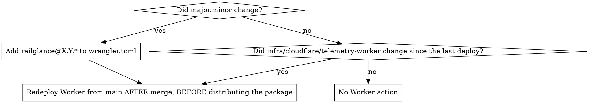

# Bumping the App Version

## Overview

A version bump is a checklist with one decision point: does the telemetry Worker need a redeploy? Everything else is mechanical and verified by `pnpm release:check`.

The release identifier is always `railglance@<package.json version>`. CI derives `VITE_APP_RELEASE` from package.json, so there is no GitHub variable to update.

## Decision: Worker redeploy



Patch bumps never edit `TELEMETRY_ALLOWED_RELEASES`: the `railglance@X.Y.*` entry already covers them. Never add an exact `railglance@X.Y.Z` entry for a new build. Keep the existing exact entries; devices older than 0.1.4 need them.

To tell whether the Worker directory changed since the last deploy:

```bash
git log -1 --format='%h %cI' -- infra/cloudflare/telemetry-worker
cd infra/cloudflare/telemetry-worker && pnpm dlx wrangler deployments list | head -20
```

If the newest commit is later than the newest deployment, redeploy.

## Procedure

1. **Preconditions.** `git fetch origin` and start from `origin/main`; working tree clean; `gh auth status` succeeds.
2. **Branch.** `git checkout -b release/X.Y.Z origin/main`.
3. **Edit versions** in exactly these files:
   - `package.json` `version`
   - `app.json` `version`
   - `.env.example` `VITE_APP_RELEASE=railglance@X.Y.Z`
   - `infra/cloudflare/telemetry-worker/wrangler.toml` only per the decision above.
4. **Verify.**
   ```bash
   pnpm release:check && pnpm lint && pnpm test && pnpm build && pnpm manifest:evenhub
   node -p "require('./dist/app.json').version"
   ```
   `release:check` fails if the versions disagree, the allowlist would reject the release, or `.env.example` is stale.
5. **Bundle diff for the PR body.** Find the commit of the previous package build (the merge commit of the last `release/*` PR, or the SHA in the last workflow summary) and list app-bundle changes since then:
   ```bash
   git diff --name-only <previous-build-sha> origin/main | grep '^src/' | grep -vE '^src/(scripts|etl)/'
   ```
   Files outside that filter (ETL, deploy scripts, Worker, docs) are not in the `.ehpk`.
6. **Commit and PR.** Title `Bump app package version to X.Y.Z for a new Even Hub beta build`. Body sections: purpose, bundle changes since the last build (from step 5), files changed, post-merge steps (copy the applicable ones from below), verification commands run. Add `Refs #<issue>` when there is one.
7. **After merge**, in this order:
   1. Worker redeploy, only if the decision says so: `cd infra/cloudflare/telemetry-worker && pnpm dlx wrangler deploy`, run from an up-to-date `main` checkout.
   2. `gh workflow run build-evenhub-package.yml --ref main`, then `gh run watch`.
   3. `gh run download <run-id>` to get `out.ehpk`. The artifact expires after 14 days.
   4. Confirm the run summary shows `Release: railglance@X.Y.Z`.
8. **Distribution** (Even Hub Private Testing, then Beta after the device gate in `docs/TELEMETRY_AND_SENTRY.md`) is a separate step and must come after the Worker redeploy when one was needed.

## Quick reference

| Situation | wrangler.toml | Worker deploy | GitHub variables |
|---|---|---|---|
| Patch bump, no Worker code change | untouched | no | none |
| Patch bump, Worker code changed since last deploy | untouched | yes, after merge | none |
| Minor or major bump | add `railglance@X.Y.*` | yes, after merge | none |

## Common mistakes

- Editing `package.json` but not `app.json`, or the reverse. The package workflow hard-fails.
- Adding `railglance@X.Y.Z` to the allowlist for a patch release. The wildcard already covers it, and the exact list is what this process replaced.
- Updating the `evenhub-beta` environment variable `VITE_APP_RELEASE`. It is no longer read; the workflow derives the value.
- Deploying the Worker before the release PR is merged. The deploy must include the Worker code and toml that are on `main`.
- Handing the package to testers before the Worker redeploy when the minor changed. The app enrolls with a release the Worker does not know and stops collecting.
- Running the package workflow from a branch other than `main`. It refuses.
- Re-running `deploy-r2` or `provision-cloudflare` as part of a version bump. They are unrelated unless the dataset or Terraform changed.
