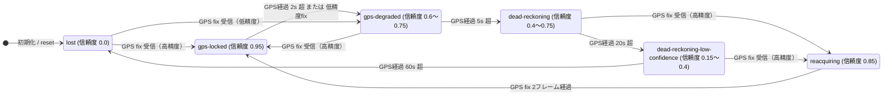
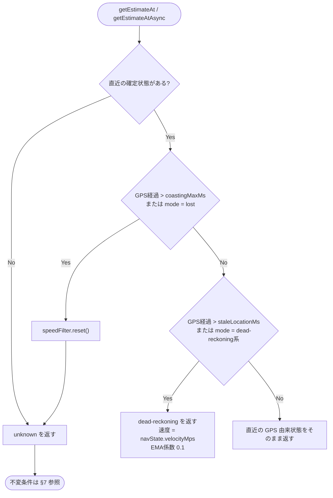
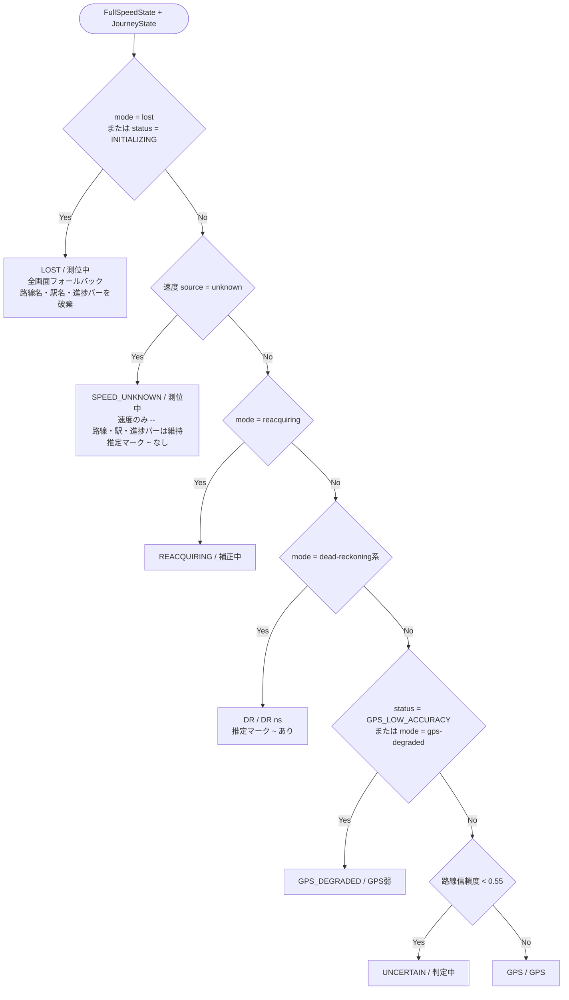

# GPS消失時の速度状態仕様

トンネル・地下区間などで GPS が途絶えたときに、速度をどこまで推定し、いつ推定を打ち切り、
HUD に何を表示するかを定める。issue #20 および PR #23 のレビュー追随で確定した挙動を明文化したもの。

関連ドキュメント:

- `docs/PHASE1_DEAD_RECKONING_REQUIREMENTS.md` — DR の要求仕様
- `docs/HUD_UI_UX_REQUIREMENTS.md` §14 — 状態別表示

---

## 1. 3層の状態

速度表示は独立した3つの状態が重なって決まる。**どれか1つだけを見て表示を決めてはならない。**

| 層 | 型 | 実装 | 意味 |
| --- | --- | --- | --- |
| 測位状態 | `NavigationMode` | `NavigationStateEstimator` | GPS がどれだけ古いか / 位置推定が生きているか |
| 速度状態 | `SpeedEstimate['source']` | `SpeedEstimator.resolveStateAt()` | 速度として何を報告するか |
| 表示状態 | `HudStatusMode` | `HudRenderer.createViewModel()` | グラス上でどう見せるか |

3層がずれる区間が存在するのが本仕様の要点である。とくに **GPS 経過 45〜60 秒**は
「測位状態はまだ `dead-reckoning-low-confidence` だが、速度状態は `unknown`」という状態になる。

---

## 2. 閾値一覧

設定可能な値と、実装にハードコードされている値を区別すること。

| 閾値 | 値 | 出所 | 役割 |
| --- | --- | --- | --- |
| `staleLocationMs` | 2000 ms | `tracking-config.ts` | GPS fix の鮮度上限。超えたら DR に引き継ぐ |
| `coastingMaxMs` | 45000 ms | `tracking-config.ts` | 最終 fix からの DR コースティング上限。超えたら `unknown` |
| gps-locked 上限 | 2000 ms | `navigation-state-estimator.ts` **ハードコード** | mode 遷移 |
| gps-degraded 上限 | 5000 ms | 同上 **ハードコード** | mode 遷移 |
| dead-reckoning 上限 | 20000 ms | 同上 **ハードコード** | mode 遷移 |
| lost 宣言 | 60000 ms 超 | 同上 **ハードコード** | mode 遷移 |
| DR 速度保持 | 3 / 15 / 45 s | 同上 **ハードコード** | 速度減衰スケジュール（§5） |
| `emaAlpha` | 0.3 | `tracking-config.ts` | GPS 由来速度の平滑化係数 |
| DR 時の EMA 係数 | 0.1 | `speed-filter.ts` **ハードコード** | DR 中の平滑化係数 |

> ⚠️ `staleLocationMs` を 2000 未満にしてはならない。`NavigationStateEstimator.predict()` は
> `gpsAgeMs > 2000` でしかコースティングを開始しないため、GPS 正常受信中に
> `source: 'dead-reckoning'` を報告してしまう。

---

## 3. 測位状態（NavigationMode）の遷移

`reacquiring` は DR からの復帰時のみ経由し、位置・速度を重み 0.35 でブレンドして
表示のジャンプを防ぐ（要件 §14.4）。

---

## 4. 速度状態の判定（`SpeedEstimator.resolveStateAt()`）

**分岐順が仕様である。** DR 分岐を先に評価すると、期限切れの fix がコースティング速度として
漏れ出す（issue #20 の原因）。

同期版 `getEstimateAt()` と非同期版 `getEstimateAtAsync()` は同じ `resolveStateAt()` を共有し、
判定順が乖離しないようにする。

---

## 5. DR 速度の減衰スケジュール

`NavigationStateEstimator.predict()` が保持する速度。加速度センサー入力ではなく
**最終 GPS 速度の保持と減衰**である（§8 参照）。

| GPS経過 | 速度の扱い |
| --- | --- |
| 〜3s | 最終有効速度 + `accelerationMps2 × dt` |
| 3〜15s | 最終有効速度を保持 |
| 15〜45s | `最終有効速度 − 0.1 × (経過秒 − 15)` m/s で線形減衰 |
| **45s 超** | **0 に落とす（ハードコード）** |

90 km/h で GPS を失った場合の実測値:

| GPS経過 | navState 速度 | 報告する速度 | HUD 表示 | mode |
| --- | --- | --- | --- | --- |
| 3s | 90.0 km/h | dead-reckoning 90 | `90 ~` | gps-degraded |
| 15s | 90.0 km/h | dead-reckoning 90 | `90 ~` | dead-reckoning |
| 30s | 84.6 km/h | dead-reckoning 84.6 | `87 ~` | dead-reckoning-low-confidence |
| 45s | 79.2 km/h | dead-reckoning 79.2 | `82 ~` | dead-reckoning-low-confidence |
| **46s** | **0.0 km/h** | **unknown** | `--` | dead-reckoning-low-confidence |
| 61s | 0.0 km/h | unknown | `--` | lost |

> `coastingMaxMs` を延ばしても 45s 超の速度は復活しない。減衰スケジュール側が 0 にするため、
> 表示される数値は EMA の残像にすぎない（実測: 46s で raw 0 km/h に対し EMA 74.1 km/h）。
> **最後の速度を無期限に固定表示してはならない**（要件 §14.6）という規定に対し、
> `coastingMaxMs` はその打ち切り点を定めるものである。

---

## 6. 表示状態（HudStatusMode）のマッピング

### `SPEED_UNKNOWN` と `LOST` の使い分け

| | `SPEED_UNKNOWN` | `LOST` |
| --- | --- | --- |
| 契機 | 速度 source が `unknown`（GPS経過 45〜60s） | `mode = lost`（GPS経過 60s 超）/ 初期化中 |
| 要件対応 | §14.5 低信頼 | §14.6 位置喪失 |
| 速度 | `--` | `--` |
| 推定マーク `~` | 非表示 | 非表示 |
| 路線名・駅名・進捗バー | **維持** | 破棄（`路線再特定中` / `---`） |
| Footer右 | `測位中` | `測位中` |

45〜60 秒の区間では線路上の推定位置がまだ生きているため、路線・駅の情報は保持する。
速度が出せないことと位置を見失ったことは別の事象として扱う。

> ⚠️ 表示状態を `navState.mode` だけで決めてはならない。45〜60 秒の区間で
> `mode` は `dead-reckoning-low-confidence` のままなので、`--` の速度に対して
> 推定マーク `~` と「DR 46s」というカウントアップが付いてしまう。

---

## 7. `unknown` 状態の不変条件

`unknown` を返すときは以下をすべて満たすこと。1つでも破ると、GPS 消失前の値が
「現在の値」として HUD やデバッグログに漏れる。

| 項目 | 値 | 理由 |
| --- | --- | --- |
| `selectedEstimate.source` | `'unknown'` | HUD の `SPEED_UNKNOWN` 判定に使う |
| `selectedEstimate.speedKmh` | `null` | `0` と `--` を明確に区別する（要件） |
| `smoothedSpeedKmh` | `null` | 同上 |
| `isValid` | `false` | `AppController` が `GPS_UNAVAILABLE` を立てる |
| `isStopped` | `false` | 46 秒前に停車していても現在の停車は主張できない |
| `candidates` | 全て `null` | 消失前の各ソース速度を現在値として記録しない |
| `SpeedFilter` | **リセット済み** | 下記参照 |

### SpeedFilter のリセットが必須である理由

`unknown` の間フィルタには何も入力されないため、EMA は GPS 消失時点の速度で凍結する。
リセットしないと GPS 復帰時の最初の fix がその値と混ざる。

実測（90 km/h → 300 秒の GPS 消失 → 停車中に GPS 復帰）:

- リセットなし: `58 → 40 → 28 → 20 → 14 → 10 → 7 → 5 → 3 → 2 → 2 → 1`（停車中の列車に 58 km/h、収束まで約 9 秒）
- リセットあり: 最初の fix で `0`

---

## 8. 既知の制約: 加速度センサーは未配線

**現状の「dead reckoning」は加速度センサーを使っていない。** 実装上の事実:

- `NavigationStateEstimator.updateWithMotion()` — 呼び出し元なし
- `DeviceMotionSensorFusionProvider.estimateSpeed()` — 呼び出し元なし（`candidates.sensorFusionSpeed` は常に `null`）
- `SpeedEstimator` が保持する provider は `setLastKnownSpeed()` のみ呼ぶ
- `main.ts` の provider は権限リクエストボタン専用の別インスタンス

`predict()` の `accelerationMps2` は `updateWithGps()` が GPS 速度差分から算出した値のみで、
しかも GPS 経過 3 秒以内の分岐でしか使われない。

この制約が §5 の「45 秒で 0 に落とす」設計の根拠になっている。加速度センサーを実際に配線して
DR を延伸する場合は、`updateWithMotion()` の接続に加えて減衰スケジュール自体の再設計が必要。

---

## 9. 未解決事項

- `NavigationStateEstimator` の閾値（2000 / 5000 / 20000 / 60000 ms）が `TrackingConfig` と
  二重管理になっている。`staleLocationMs` を変更しても追従しない。
- `getEstimateAtAsync()` に `await` がなく、同期版 `getEstimateAt()` は本番の呼び出し元を持たない。
- `AppController` は `isValid === false` で `GPS_UNAVAILABLE` を立てるが、低精度 fix でも
  `isValid` は `false` になるため、この status を「GPS 消失」の判定に使ってはならない。

---

## 10. 参照実装とテスト

| 対象 | 実装 | テスト |
| --- | --- | --- |
| 分岐順・不変条件 | `src/domain/speed/speed-estimator.ts` | `tests/speed/speed-estimator.test.ts` |
| mode 遷移・減衰 | `src/domain/speed/navigation-state-estimator.ts` | 同上（間接） |
| 表示マッピング | `src/infrastructure/even-g2/hud-renderer.ts` | `tests/even-g2/hud-renderer.test.ts` |
| 閾値 | `src/config/tracking-config.ts` | — |
