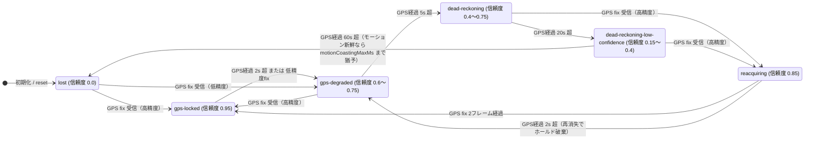
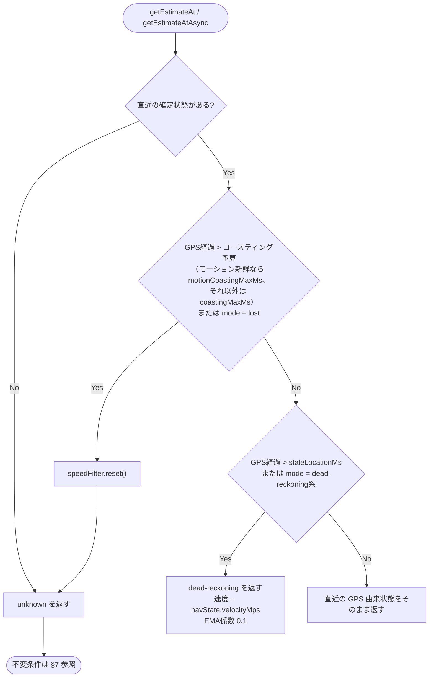

# GPS消失時の速度状態仕様

トンネル・地下区間などで GPS が途絶えたときに、速度をどこまで推定し、いつ推定を打ち切り、
HUD に何を表示するかを定める。issue #20 および PR #23 のレビュー追随で確定した挙動を明文化したもの。

関連ドキュメント:

- `docs/PHASE1_DEAD_RECKONING_REQUIREMENTS.md` — DR の要求仕様
- `docs/HUD_UI_UX_REQUIREMENTS.md` §14 — 状態別表示

---

## 1. 3層の状態

速度表示は独立した3つの状態が重なって決まる。**どれか1つだけを見て表示を決めてはならない。**

| 層 | 型 | 実装 | 意味 |
| --- | --- | --- | --- |
| 測位状態 | `NavigationMode` | `NavigationStateEstimator` | GPS がどれだけ古いか / 位置推定が生きているか |
| 速度状態 | `SpeedEstimate['source']` | `SpeedEstimator.resolveStateAt()` | 速度として何を報告するか |
| 表示状態 | `HudStatusMode` | `HudRenderer.createViewModel()` | グラス上でどう見せるか |

3層がずれる区間が存在するのが本仕様の要点である。とくに **GPS 経過 45〜60 秒**は
「測位状態はまだ `dead-reckoning-low-confidence` だが、速度状態は `unknown`」という状態になる
（モーションセンサー無しの場合。センサーが新鮮な間は §8 の延伸が働き、この区間も
`dead-reckoning` のまま速度を表示し続ける）。

---

## 2. 閾値一覧

設定可能な値と、実装にハードコードされている値を区別すること。

| 閾値 | 値 | 出所 | 役割 |
| --- | --- | --- | --- |
| `staleLocationMs` | 2000 ms | `tracking-config.ts` | GPS fix の鮮度上限。超えたら DR に引き継ぐ |
| `coastingMaxMs` | 45000 ms | `tracking-config.ts` | 最終 fix からの DR コースティング上限。超えたら `unknown` |
| `motionCoastingMaxMs` | 180000 ms | `tracking-config.ts` | 加速度センサーが新鮮な間の延伸コースティング上限（§8）。`coastingMaxMs` 以上にすること |
| `motionFreshnessMs` | 2000 ms | `tracking-config.ts` | モーション観測を「新鮮」とみなす上限（`0 ≤ 経過 ≤ 本値`。未来 timestamp は無効）。超えたら 45s 予算へ即時フォールバック |
| gps-locked 上限 | 2000 ms | `navigation-state-estimator.ts` **ハードコード** | mode 遷移 |
| gps-degraded 上限 | 5000 ms | 同上 **ハードコード** | mode 遷移 |
| dead-reckoning 上限 | 20000 ms | 同上 **ハードコード** | mode 遷移 |
| lost 宣言 | 60000 ms 超 | 同上 **ハードコード** | mode 遷移 |
| DR 速度保持 | 3 / 15 / 45 s | 同上 **ハードコード** | 速度減衰スケジュール（§5） |
| reacquiring ホールド破棄 | 2000 ms | 同上 **ハードコード** | 再消失時に mode 遷移を再開（§3） |
| 静止時ブレーキ | 1.5 m/s² | 同上 **ハードコード** | 静止検出時に速度を 0 へ（§8.3） |
| コースティング上昇制限 | 0.8 m/s² | 同上 **ハードコード** | GPS 無しでの速度復活防止。全 DR 分岐に適用（§8.3） |
| 線形ドラッグ | 0.1 m/s²（15s 起点） | 同上 **ハードコード** | 15s 超の減衰。モーション延伸中は 45s 超も同式（§5, §8.3） |
| 停車 fix の加速度クリア | 観測速度 < 0.5 m/s | 同上 **ハードコード** | 残留加速度による停車列車の再加速防止（§5） |
| 静止判定 | 振動 < 0.05 m/s² かつ 正味加速度 < 0.5 m/s² を 3 s 持続 | `device-motion-sensor-fusion-provider.ts` **ハードコード** | `isStillInferred` の判定（§8.2） |
| `emaAlpha` | 0.3 | `tracking-config.ts` | GPS 由来速度の平滑化係数 |
| DR 時の EMA 係数 | 0.1 | `speed-filter.ts` **ハードコード** | DR 中の平滑化係数 |
| HUD 路線信頼度閾値 | 0.55 | `hud-renderer.ts` **ハードコード**（2箇所） | UNCERTAIN 判定・路線名の表示可否（§6） |

> ⚠️ `staleLocationMs` を 2000 未満にしてはならない。`NavigationStateEstimator.predict()` は
> `gpsAgeMs > 2000` でしかコースティングを開始しないため、GPS 正常受信中に
> `source: 'dead-reckoning'` を報告してしまう。

---

## 3. 測位状態（NavigationMode）の遷移



`reacquiring` は DR からの復帰時のみ経由し、位置・速度を重み 0.35 でブレンドして
表示のジャンプを防ぐ（要件 §14.4）。

`reacquiring` のホールドは GPS fix が到着し続ける間だけ維持される。ブレンド用の
2 フレームを消費する前に再び GPS が途絶えた場合（GPS経過 2 秒超）はホールドを破棄し、
通常の経過時間ベースの遷移（`gps-degraded` → `dead-reckoning` → … → `lost`）に戻る。
この破棄がないと、トンネル内で fix が1発だけ入って再消失したとき mode が信頼度 0.85 の
`reacquiring` に永久に張り付き、速度が `unknown` になっても HUD が `LOST` に落ちず
路線・駅表示が無期限に残る（要件 §14.6 違反）。

---

## 4. 速度状態の判定（`SpeedEstimator.resolveStateAt()`）

**分岐順が仕様である。** DR 分岐を先に評価すると、期限切れの fix がコースティング速度として
漏れ出す（issue #20 の原因）。



同期版 `getEstimateAt()` と非同期版 `getEstimateAtAsync()` は同じ `resolveStateAt()` を共有し、
判定順が乖離しないようにする。

---

## 5. DR 速度の減衰スケジュール（GPS-only）

`NavigationStateEstimator.predict()` が保持する速度。本節は**加速度センサーが
利用できない（または途絶した）場合**の基本スケジュールであり、センサーが新鮮な間の
挙動は §8.3 が上書きする。ベースは**最終 GPS 速度の保持と減衰**である。

| GPS経過 | 速度の扱い |
| --- | --- |
| 〜3s | アンカー + `accelerationMps2 × dt`（dt は predict の tick 間隔） |
| 3〜15s | アンカーを保持 |
| 15〜45s | `アンカー − 0.1 × (経過秒 − 15)` m/s で線形減衰（**GPS 経過の絶対時刻ベース**。tick 頻度に依存しない） |
| **45s 超** | **0 に落とす**（モーション新鮮時は同じ線形式が `motionCoastingMaxMs` まで延長される。§8.3） |

保持のアンカーは**直近の有効 fix の観測速度**（reacquiring ブレンド前の値）であり、
0 km/h の有効 fix でも更新される。ブレンド後の値をアンカーにすると、DR 中に 0 km/h fix が
1 発だけ入って再消失したとき、ブレンド残りの速度（実測 56 km/h）が復活する。
また、ほぼ 0（< 0.5 m/s）の fix では残留 `accelerationMps2` もクリアする。停車 fix 自体は
巨大な負の速度差分が外れ値棄却されるため残留加速度を消せず、〜3s 分岐が停車中の列車を
再加速してしまう（実測 13.8 km/h）。

いずれの分岐でも、速度の上昇はスルーレート 0.8 m/s² に制限される（§8.3）。

> ⚠️ 〜3s 区間の `dt` は predict の tick 間隔（100〜250ms）であり、GPS 経過時間ではない。
> 毎 tick アンカーから再計算されるため加速度項は**累積しない**。寄与は
> `a × 1tick分` に留まり実質無視できる（モーション観測は符号付き加速度を主張しないため、
> `accelerationMps2` の由来は GPS 速度差分のみ。§8.2）。
> 3 秒間の外挿積分と読んではならない。

90 km/h で GPS を失った場合の実測値（モーションセンサー無し）:

| GPS経過 | navState 速度 | 報告する速度 | HUD 表示 | mode |
| --- | --- | --- | --- | --- |
| 3s | 90.0 km/h | dead-reckoning 90 | `90 ~` | gps-degraded |
| 15s | 90.0 km/h | dead-reckoning 90 | `90 ~` | dead-reckoning |
| 30s | 84.6 km/h | dead-reckoning 84.6 | `87 ~` | dead-reckoning-low-confidence |
| 45s | 79.2 km/h | dead-reckoning 79.2 | `82 ~` | dead-reckoning-low-confidence |
| **46s** | **0.0 km/h** | **unknown** | `--` | dead-reckoning-low-confidence |
| 61s | 0.0 km/h | unknown | `--` | lost |

> センサー無しで `coastingMaxMs` だけを延ばしても 45s 超の速度は復活しない。減衰スケジュール側が
> 0 にするため、表示される数値は EMA の残像にすぎない（実測: 46s で raw 0 km/h に対し EMA 74.1 km/h）。
> **最後の速度を無期限に固定表示してはならない**（要件 §14.6）という規定に対し、
> `coastingMaxMs` はその打ち切り点を定めるものである。45s 超のコースティングを正当化できるのは
> センサーの裏付け（§8）だけであり、その場合の打ち切り点が `motionCoastingMaxMs` である。

---

## 6. 表示状態（HudStatusMode）のマッピング


### `SPEED_UNKNOWN` と `LOST` の使い分け

| | `SPEED_UNKNOWN` | `LOST` |
| --- | --- | --- |
| 契機 | 速度 source が `unknown`（GPS経過 45〜60s） | `mode = lost`（GPS経過 60s 超）/ 初期化中 |
| 要件対応 | §14.5 低信頼（速度不明） | §14.6 位置喪失 |
| 速度 | `--` | `--` |
| 推定マーク `~` | 非表示 | 非表示 |
| 路線名・駅名・進捗バー | **維持** | 破棄（`路線再特定中` / `---`） |
| Footer右 | `測位中` | `測位中` |

45〜60 秒の区間では線路上の推定位置がまだ生きているため、路線・駅の情報は保持する。
速度が出せないことと位置を見失ったことは別の事象として扱う。

> ⚠️ 表示状態を `navState.mode` だけで決めてはならない。45〜60 秒の区間で
> `mode` は `dead-reckoning-low-confidence` のままなので、`--` の速度に対して
> 推定マーク `~` と「DR 46s」というカウントアップが付いてしまう。

---

## 7. `unknown` 状態の不変条件

`unknown` を返すときは以下をすべて満たすこと。1つでも破ると、GPS 消失前の値が
「現在の値」として HUD やデバッグログに漏れる。

| 項目 | 値 | 理由 |
| --- | --- | --- |
| `selectedEstimate.source` | `'unknown'` | HUD の `SPEED_UNKNOWN` 判定に使う |
| `selectedEstimate.speedKmh` | `null` | `0` と `--` を明確に区別する（要件） |
| `smoothedSpeedKmh` | `null` | 同上 |
| `isValid` | `false` | `AppController` が `GPS_UNAVAILABLE` を立てる |
| `isStopped` | `false` | 46 秒前に停車していても現在の停車は主張できない |
| `candidates` | 全て `null` | 消失前の各ソース速度を現在値として記録しない |
| `SpeedFilter` | **リセット済み** | 下記参照 |

### SpeedFilter のリセットが必須である理由

`unknown` の間フィルタには何も入力されないため、EMA は GPS 消失時点の速度で凍結する。
リセットしないと GPS 復帰時の最初の fix がその値と混ざる。

実測（90 km/h → 300 秒の GPS 消失 → 停車中に GPS 復帰）:

- リセットなし: `58 → 40 → 28 → 20 → 14 → 10 → 7 → 5 → 3 → 2 → 2 → 1`（停車中の列車に 58 km/h、収束まで約 9 秒）
- リセットあり: 最初の fix で `0`

---

## 8. 加速度センサーによるコースティング延伸

加速度センサーは DR に配線済み（要件 §9 のとおり**補助入力**であり、無くても §5 の
GPS-only スケジュールで動作する）。

### 8.1 配線経路（pull 型）

```text
devicemotion イベント
  → DeviceMotionSensorFusionProvider.ingestAccelerationSample()
      （静止/振動の推定を更新）
  → SpeedEstimator.getEstimateAt / getEstimateAtAsync が毎 tick
      provider.getLatestObservation() を pull
  → NavigationStateEstimator.updateWithMotion() に投入
  → predict() が鮮度を判定してコースティングに反映
```

push 購読は存在しない。render tick（100〜250ms）ごとの pull で十分な鮮度が得られる。

### 8.2 センサーが主張できること・できないこと

デバイスの姿勢推定（orientation fusion）が無いため、**進行方向の符号付き加速度は取得できない**。
`MotionObservation.trackAccelerationMps2` は常に `null` であり、センサーが主張するのは
以下の 2 値のみ:

| 主張 | 検出方法 |
| --- | --- |
| 静止（`isStillInferred: true`） | 振動エネルギー（瞬時 magnitude と自身の EMA の偏差の EMA）が 0.05 m/s² 未満、**かつ** EMA 正味加速度（EMA magnitude − 重力基準）が 0.5 m/s² 未満、**かつ** 持続 3 秒以上 |
| 走行中（`isStillInferred: false`） | 上記以外（車体振動または持続的な正味加速度が検出されている） |

> ⚠️ magnitude の平均値だけでは静止と定速走行を区別できない（どちらも平均 ≈ 9.8）。
> 判定には必ず振動（EMA からの偏差）を使うこと。また重力の基準値は実際に使用した
> 配列（`acceleration` / `accelerationIncludingGravity`）に対応させること。
> gravity-free の値に 9.8 を引いた過去実装では静止が永遠に検出されなかった。

> ⚠️ **既知の盲点**: 振動エネルギーは magnitude のスカラー変動しか見ないため、
> magnitude が一定になる方向反転（例: `x = ±0.5, z = g` の横揺れ。|a| = √(0.25+g²) で一定）は
> 検出できず、走行中を静止と誤判定し得る。誤判定の帰結は 1.5 m/s² の強制ブレーキ
> （走行中に速度 0 表示）なので影響が大きい。軸別ハイパス＋ベクトル RMS への変更と
> 実機較正が必要（§9）。

### 8.3 コースティングへの反映

| センサー状態 | 速度への作用 | 打ち切り予算 |
| --- | --- | --- |
| 新鮮（0 ≤ 経過 ≤ `motionFreshnessMs`）・走行中 | §5 の線形ドラッグ式（15s 起点、0.1 m/s²）を 45s 超もそのまま延長。**GPS 経過の絶対時刻ベース**なので tick 頻度・単発プローブで結果が変わらない | `motionCoastingMaxMs`（180s） |
| 新鮮・静止 | 1.5 m/s² で 0 へブレーキ（HUD は `--` でなく `0 ~` を表示） | `motionCoastingMaxMs`（180s） |
| 途絶（> `motionFreshnessMs`）または未来 timestamp | §5 の GPS-only スケジュールに即時フォールバック | `coastingMaxMs`（45s） |

鮮度判定は `0 ≤ now − timestamp ≤ motionFreshnessMs`。未来の timestamp（時計逆行・
順序逆転）は新鮮扱いしない。時計逆行後にセンサーが途絶すると、時計が追いつくまで
延伸が残り続けるためである。

mode の `lost` 宣言（60s）も、センサーが新鮮な間は `motionCoastingMaxMs` まで猶予され、
`dead-reckoning-low-confidence`（信頼度 0.15）に留まる。

**速度の復活防止（スルーレート制限）:** 保持スケジュールは GPS 消失前の速度に
アンカーされているため、静止検出で 0 になった後に振動が再開すると、素朴な実装では
消失前の速度が瞬時に復活する。コースティング中の速度上昇は全分岐で 0.8 m/s²
（現実的な列車の加速度）に制限する。静止→再走行では、この制限の下で線形ドラッグの
目標値に向かって 0 からランプアップする（45s 超の延伸区間でも同様）。
同じ理由で、**停車直後に GPS が消えた場合**の保持アンカーはブレーキ前の速度ではなく
直近の有効 fix の**観測**速度（= 0。reacquiring ブレンド前）でなければならない（§5）。

実測（90 km/h で GPS 消失、センサーが走行中を報告し続けた場合）:

| GPS経過 | 報告する速度 | mode |
| --- | --- | --- |
| 45s | dead-reckoning 79.2 | dead-reckoning-low-confidence |
| 61s | dead-reckoning 73.4 | dead-reckoning-low-confidence（lost 猶予） |
| 120s | dead-reckoning 52.2 | dead-reckoning-low-confidence |
| 180s | dead-reckoning 30.6 | dead-reckoning-low-confidence |
| 181s | **unknown** | **lost** |

### 8.4 残存する制約

- 符号付き進行方向加速度は無いため、走行中の加減速はセンサーから推定できない
  （減衰はあくまで §5/§8.3 のスケジュール）。orientation fusion は Phase 2/3。
- `DeviceMotionSensorFusionProvider.estimateSpeed()` は引き続き未使用
  （`candidates.sensorFusionSpeed` は常に `null`）。
- `main.ts` の provider は権限リクエストボタン専用の別インスタンス
  （権限はグローバルなので `SpeedEstimator` 内のインスタンスにも効く）。

---

## 9. 未解決事項

- `NavigationStateEstimator` の閾値（2000 / 5000 / 20000 / 60000 ms）が `TrackingConfig` と
  二重管理になっている。`staleLocationMs` を変更しても追従しない。
- 減衰スケジュールのゼロ点（45s、`navigation-state-estimator.ts` ハードコード）と
  `coastingMaxMs`（45000 ms、設定値）も独立した値の二重管理である。揃っていないと
  §5 の注記の症状（EMA の残像だけが表示される）が出るため、片方をもう片方から導出すべき。
- `getEstimateAtAsync()` に `await` がなく、同期版 `getEstimateAt()` は本番の呼び出し元を持たない。
- `AppController` は `isValid === false` で `GPS_UNAVAILABLE` を立てるが、低精度 fix でも
  `isValid` は `false` になるため、この status を「GPS 消失」の判定に使ってはならない。
- 静止検出の閾値（振動 0.05 m/s² / 正味加速度 0.5 m/s² / 持続 3 s）は実機の車内データで
  未較正。誤って静止と判定すると走行中に速度が 0 へ落ちるため、実機検証（要件 §9 の
  チェックリスト）とあわせて調整が必要。
- 静止検出は magnitude 一定の方向反転振動（横揺れ）に盲目（§8.2 の既知の盲点）。
  軸別ハイパス＋ベクトル RMS への置き換えと、確証がない場合の第 3 状態
  （unknown: 延伸もブレーキも無効）の導入を検討。
- DR 中の EMA 係数 0.1 により、静止検出後の表示速度が実推定値に対して十数秒遅れて追従する
  （実測: ブレーキ開始 10 秒後に raw 18 km/h に対し表示 53 km/h）。
- 速度のコースティング予算（`resolveStateAt`）と mode の lost 宣言（`updateNavigationMode`）は
  別々に判定される。`coastingMaxMs` を 60s 超に設定すると、mode 側のハードコード 60s が先に
  `lost` を宣言して速度を打ち切る。設定ロード時の不変条件検証
  （`staleLocationMs ≥ 2000`、`coastingMaxMs ≤ 60000`、`motionCoastingMaxMs ≥ coastingMaxMs`）が無い。
- `SpeedEstimator`（domain）が `DeviceMotionSensorFusionProvider`（infrastructure）を
  デフォルト値として直接 new しており、依存逆転が composition root まで届いていない。
  権限 UI 用（`main.ts`）と推定用で provider が二重生成されている。bootstrap で一度だけ
  生成して注入すべき。

---

## 10. 参照実装とテスト

| 対象 | 実装 | テスト |
| --- | --- | --- |
| 分岐順・不変条件 | `src/domain/speed/speed-estimator.ts` | `tests/speed/speed-estimator.test.ts` |
| mode 遷移・減衰・モーション延伸 | `src/domain/speed/navigation-state-estimator.ts` | 同上（間接） |
| 静止/振動の検出 | `src/infrastructure/sensors/device-motion-sensor-fusion-provider.ts` | `tests/sensors/device-motion-sensor-fusion-provider.test.ts` |
| 表示マッピング | `src/infrastructure/even-g2/hud-renderer.ts` | `tests/even-g2/hud-renderer.test.ts` |
| 閾値 | `src/config/tracking-config.ts` | — |
